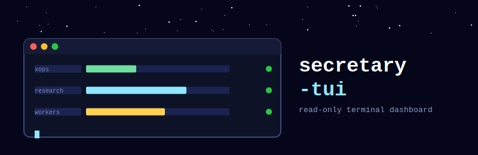

<p align="center">
  
</p>

<p align="center">
  
  
  
  
</p>

「秘書の朝刊」— xops投稿キュー・RAG研究の蓄積・ローカルLLM workerの状態を1画面にまとめる、
**読み取り専用**のターミナルダッシュボード。

「ログを見に行かない」思想の実装版。何も書き換えない・何も承認しない・観測するだけ。

---

## できること

| パネル | 表示内容 | ソース |
|--------|----------|--------|
| xops spool | queued / sending / posted / failed 件数、最終送信時刻 | `~/Workspace/Projects/Umeboshi/xops/spool/` |
| RAG research | `active/research/` 配下の記事数 | `~/Workspace/RAG/active/research/` |
| local LLM workers | alias一覧・backend・host・状態(●緑=ready) | `~/Workspace/scripts/llm-seat.sh list` |

10秒ごとに自動更新。`r`キーで手動更新、`q`/`Esc`/`Ctrl-C`で終了。

### 実際の出力例（`--dump`）

```
 秘書の朝刊   — 読み取り専用ダッシュボード（q終了 / r更新）

╭─────────────────────────────────────╮ ╭────────────────╮
│  xops spool                         │ │  RAG research  │
│ queued : 0                          │ │ 記事数: 217 件 │
│ sending: 0                          │ ╰────────────────╯
│ posted : 125                        │
│ failed : 0                          │
│ last   : 2026-07-02T15:57:02.730390 │
╰─────────────────────────────────────╯

╭───────────────────────────────────────╮
│  local LLM workers                    │
│ ● gemma-fast-mini      ollama/mini    │
│ ● gemma-26b-qat-mini   llama.cpp/mini │
│ ● qwen-fast-mini       ollama/mini    │
│ ● embed-mini           ollama/mini    │
│ ...                                    │
╰───────────────────────────────────────╯

最終更新 20:40:15
```

実際の画面はターミナル上でカラー表示されます（緑=queued/ready、水色=research、金=workers）。

---

## ビルド・実行

```bash
git clone https://github.com/UMEBOSHIISAN/secretary-tui.git
cd secretary-tui
export PATH="/opt/homebrew/bin:$PATH"   # go コマンドが見えない場合
go build -o secretary-tui .
./secretary-tui
```

`--dump` フラグで1回だけ描画してプレーンテキスト出力（動作確認・デバッグ用）:

```bash
./secretary-tui --dump
```

---

## 構成

```
secretary-tui/
├── main.go     # bubbletea model/update/view 全部（小さいので分割していない）
├── go.mod
├── assets/
│   └── logo.svg
├── README.md
└── CHANGELOG.md
```

- [bubbletea](https://github.com/charmbracelet/bubbletea) — TUIフレームワーク
- [lipgloss](https://github.com/charmbracelet/lipgloss) — スタイリング

---

## 前提

- `~/Workspace/scripts/llm-seat.sh` が存在すること（なくてもクラッシュせず空欄表示）
- xops/RAGのパスが読めること（読み取りのみ、書き込み一切なし）
- このリポジトリはうめぼし個人のローカル運用パスに依存しています。他環境で使う場合は
  `main.go`内の`filepath.Join(home, ...)`のパスを自分の環境に合わせて書き換えてください。

---

## ⚠️ Safety / Scope

**secretary-tuiは観測専用ツールです。承認・実行・意思決定の代替ではありません。**

- 書き込み・実行・承認・通知の送信は一切しない。ファイルシステムへの読み取りアクセスのみ
- worker稼働状況は `llm-seat.sh list` の静的な `ready` 表示。プロセスの実稼働確認ではない
- 表示されている数値はキャッシュ/スナップショットの可能性がある。重要な判断の前には元データ(xops/RAG本体)を直接確認すること
- このダッシュボードの表示のみを根拠に「稼働している」「停止している」と断定しない

---

## 関連プロジェクト

- [m5-agent-stars](https://github.com/UMEBOSHIISAN/m5-agent-stars) — 同じ「観測して人間が判断する」思想の物理ディスプレイ版

---

## ライセンス

MIT — 遊び・実験用。xops / 本番 ops とは独立。
