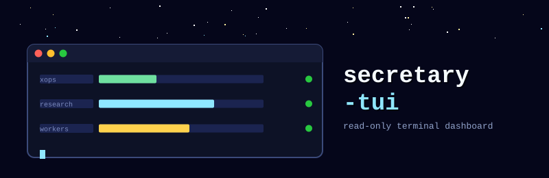

<p align="center">
  
</p>

<p align="center">
  
  
  
  
</p>

「秘書の朝刊」— xops投稿キュー・RAG研究の蓄積・ローカルLLM workerの状態を1画面にまとめる、
**読み取り専用**のターミナルダッシュボード。

「ログを見に行かない」思想の実装版。何も書き換えない・何も承認しない・観測するだけ。

---

## できること

| パネル | 表示内容 | ソース |
|--------|----------|--------|
| xops spool | queued / sending / posted / failed 件数、最終送信時刻 | `~/Workspace/Projects/Umeboshi/xops/spool/` |
| RAG research | `active/research/` 配下の記事数 | `~/Workspace/RAG/active/research/` |
| local LLM workers | alias一覧・backend・host・状態(●緑=ready) | `~/Workspace/scripts/llm-seat.sh list` |
| AI governance（任意） | WGM handoffまたはRouter dry-run manifestの安全な要約 | `--governance`で明示したローカルJSON |

10秒ごとに自動更新。`r`キーで手動更新、`q`/`Esc`/`Ctrl-C`で終了。

### 実際の動作（GIF）

<p align="center">
  
</p>

実行→自動更新(`r`)→終了(`q`)までの一連の流れ（[vhs](https://github.com/charmbracelet/vhs)で録画）。

### テキスト出力例（`--dump`）

```
 秘書の朝刊   — 読み取り専用ダッシュボード（q終了 / r更新）

╭─────────────────────────────────────╮ ╭────────────────╮
│  xops spool                         │ │  RAG research  │
│ queued : 0                          │ │ 記事数: 217 件 │
│ sending: 0                          │ ╰────────────────╯
│ posted : 125                        │
│ failed : 0                          │
│ last   : 2026-07-02T15:57:02.730390 │
╰─────────────────────────────────────╯

╭───────────────────────────────────────╮
│  local LLM workers                    │
│ ● gemma-fast-mini      ollama/mini    │
│ ● gemma-26b-qat-mini   llama.cpp/mini │
│ ● qwen-fast-mini       ollama/mini    │
│ ● embed-mini           ollama/mini    │
│ ...                                    │
╰───────────────────────────────────────╯

最終更新 20:40:15
```

実際の画面はターミナル上でカラー表示されます（緑=queued/ready、水色=research、金=workers）。

---

## ビルド・実行

```bash
git clone https://github.com/UMEBOSHIISAN/secretary-tui.git
cd secretary-tui
export PATH="/opt/homebrew/bin:$PATH"   # go コマンドが見えない場合
go build -o secretary-tui .
./secretary-tui
```

`--dump` フラグで1回だけ描画してプレーンテキスト出力（動作確認・デバッグ用）:

```bash
./secretary-tui --dump
```

### WGM / Mothership Routerの観測

公開済みの[Workflow Governance Model](https://github.com/UMEBOSHIISAN/workflow-governance-model)
または[Mothership Router](https://github.com/UMEBOSHIISAN/mothership-router)の結果を、
明示したファイルから読み取り専用で表示できます。

```bash
./secretary-tui --governance ./wgm-handoff.json
./secretary-tui --dump --governance ./router-manifest.json
```

Router manifest 1.0 またはWGM handoff 1.1（1.0互換読取あり）を、dashboard更新・home directory参照・
外部コマンド実行なしで、機械可読な観測JSONへ変換する独立モード:

```bash
./secretary-tui --snapshot-json --governance ./router-manifest.json
```

出力はcompact JSON 1件と改行だけです。`--snapshot-json`は`--governance`を必須とし、
`--dump`との併用を入力ファイルを読む前に拒否します。

対応範囲:

| 入力 | 対応バージョン | 表示 |
|------|----------------|------|
| WGM public handoff | WGM 0.2.x / handoff schema 1.1（1.0互換読取） | task ID、capability、risk、token budget、evidence件数 |
| Router manifest | Mothership Router 0.3.x / manifest 1.0 | status、candidate alias、reasons。snapshot export対応 |
| Router manifest（legacy） | Mothership Router 0.2.x / unversioned | dashboard表示のみ。snapshot export不可 |

ファイルは自動探索しません。1 MiBを超えるファイル、壊れたJSON、非対応形式、
秘密情報を示すキー、portable ASCII token grammar外の公開識別子、
またはauthority/execution effectが`true`のmanifestはfail-closedで拒否します。
公開識別子は先頭英数字、以降は英数字・`.`・`_`・`:`・`-`のみで、
drive-relative `X:` prefixは拒否します。
新規連携はportable contractであるWGM 1.1を使用します。1.0入力も認識しますが、
Secretary側のfail-closedなconsumer policyは同様に適用します。
表示はローカルsnapshotであり、承認・実行・鮮度の証明ではありません。

### Mothership conformance

Secretary TUIが`observation-snapshot` 1.0の意味とschemaを所有します。
[`suite/mothership-0.2-conformance.json`](suite/mothership-0.2-conformance.json)は
owner schemaのSHA-256と、credentialを含まない合成例を固定します。
[Mothership 0.2](https://github.com/UMEBOSHIISAN/mothership)はそのowner bytesを
凍結して任意のcompanion chainを検査します。conformanceが証明するのはshape・version・
effectが常にfalseであることだけで、承認・実行・鮮度・remote公開は証明しません。

---

## 構成

```
secretary-tui/
├── main.go             # bubbletea model/update/view 全部（小さいので分割していない）
├── governance.go       # governance JSONの安全な読み取り・要約
├── governance_test.go  # reader・秘密情報境界・表示の単体テスト
├── conformance_test.go # observation schema・CLI隔離・Mothership適合テスト
├── schemas/            # observation-snapshot 1.0 owner schema
├── suite/              # Mothership 0.2 conformance manifest
├── examples/           # 合成Router入力とcanonical observation出力
├── go.mod / go.sum
├── demo.tape           # assets/demo.gif を撮り直すための vhs スクリプト
├── assets/
│   ├── logo.svg
│   └── demo.gif
├── docs/superpowers/   # governance パネルの設計・実装計画
├── .github/workflows/build.yml
├── LICENSE
├── Plans.md
├── README.md
└── CHANGELOG.md
```

- [bubbletea](https://github.com/charmbracelet/bubbletea) — TUIフレームワーク
- [lipgloss](https://github.com/charmbracelet/lipgloss) — スタイリング

---

## 前提

- `~/Workspace/scripts/llm-seat.sh` が存在すること（なくてもクラッシュせず空欄表示）
- xops/RAGのパスが読めること（読み取りのみ、書き込み一切なし）
- このリポジトリはうめぼし個人のローカル運用パスに依存しています。他環境で使う場合は
  `main.go`内の`filepath.Join(home, ...)`のパスを自分の環境に合わせて書き換えてください。

---

## ⚠️ Safety / Scope

**secretary-tuiは観測専用ツールです。承認・実行・意思決定の代替ではありません。**

- ファイルへの書き込み・承認・通知の送信は一切しない。ファイルシステムへの読み取りアクセスが基本
- `--governance`は指定された1ファイルだけを読み、raw JSONや秘密値を表示しない
- `--snapshot-json`は明示されたgovernanceファイル以外を読まず、home/RAG/xopsを参照せず、外部コマンドもtimerも起動しない
- governance表示は`authority: none` / `execution: none`を常に明示する
- dashboard modeでの唯一の外部コマンド実行は `llm-seat.sh list`（worker状態を取得する読み取り専用サブコマンド）のみ。それ以外の実行・変更操作はしない
- worker稼働状況は `llm-seat.sh list` の静的な `ready` 表示。プロセスの実稼働確認ではない
- 表示されている数値はキャッシュ/スナップショットの可能性がある。重要な判断の前には元データ(xops/RAG本体)を直接確認すること
- このダッシュボードの表示のみを根拠に「稼働している」「停止している」と断定しない

---

## 関連プロジェクト

- [m5-agent-stars](https://github.com/UMEBOSHIISAN/m5-agent-stars) — 同じ「観測して人間が判断する」思想の物理ディスプレイ版
- [Workflow Governance Model](https://github.com/UMEBOSHIISAN/workflow-governance-model) — evidenceとauthority trailの検証
- [Mothership Router](https://github.com/UMEBOSHIISAN/mothership-router) — 人間承認境界付きdry-run routing
- [Mothership](https://github.com/UMEBOSHIISAN/mothership) — portable control-plane contractsとdiagnostics

---

## ライセンス

MIT — 遊び・実験用。xops / 本番 ops とは独立。
